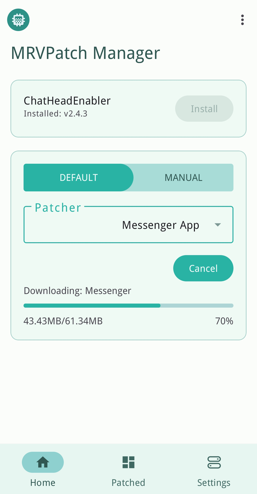

# MRVPatch Manager

MRVPatch Manager is an APK patching app that enables you to use [ChatHeadEnabler](https://github.com/NeonOrbit/ChatHeadEnabler)
(along with other Xposed modules) on non-rooted devices.

<picture></picture>

## Features
- Direct download from multiple APK servers.
- Manual patching option for offline APKs.
- Ensures safety by checking APK signature.
- Download specific versions and ABI types.
- Selection from a variety of APK servers.
- Support for allowing third-party modules.
- Support for signing with a custom keystore.

## Support
Watch the [video tutorial](https://www.youtube.com/watch?v=UxHSTHam42w) for instructions.  
Refer to the [xda thread](https://forum.xda-developers.com/t/4331215) for more details.

------------
Certificate:
```
SHA-1: FE20183C7D2F5C5D9FE1BCE6B7AB31A35FF4C8D0
SHA-256: 91870331A45A1C1E8F34BB27D6973CD72FD8AD98CBF4B306276BFEC06D61EBE8
```
License:
```
Copyright (C) 2022 NeonOrbit

This program is free software: you can redistribute it and/or modify
it under the terms of the GNU General Public License as published by
the Free Software Foundation, either version 3 of the License, or
(at your option) any later version.

This program is distributed in the hope that it will be useful,
but WITHOUT ANY WARRANTY; without even the implied warranty of
MERCHANTABILITY or FITNESS FOR A PARTICULAR PURPOSE.  See the
GNU General Public License for more details.

You should have received a copy of the GNU General Public License
along with this program.  If not, see <https://www.gnu.org/licenses/>.
```
